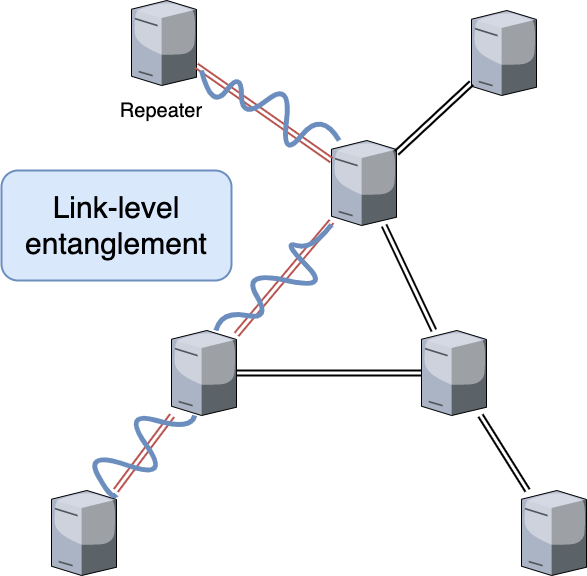

# Quantum Repeater

## What is this?

Quantum Repeater is one crucial network device in entanglement-based quantum networking, which allows us to extend link-level entanglement to end-to-end entanglement. 

The main works of quantum repeaters are following.

1. Creating elementary entanglement
2. Entanglement extension
3. Error management
4. Network operations

### 1. Creating elementary entanglement

Quantum Repeater generates entanglement between neighbor nodes known as link-level entanglement. 

 

Several link types have been proposed, such as Memory-Memory architecture, Memory-Interfere-Memory architecture.

### 2. Entanglement extension

The entanglement swapping is performed in each repeater station and extends link-level entanglement to end-to-end entanglement. 

### 3. Error management

Quantum error is one critical obstacle for large-scale quantum networking. Keeping the fidelity of the quantum state is also one important task of a quantum repeater. For the near future (called 1G quantum networking), entanglement purification plays an important role to find errors in the quantum state and improving its quality.

### 4. Network operations

The repeater node behaves as an ordinal network node that is responsible for routing, multiplexing, etc. 

## What is the interface to the outside world?

### Quantum Interface

QNIC (Quantum Network Interface Card) is the interface of quantum repeaters. QNIC contains quantum memories to store quantum information. 

### Classical Interface

Same as the classical network devices, the classical interface of the repeater is NIC.  

## How is it divided up into subsystems?

The quantum repeater is divided up into several subsystems. 

 

### Quantum Repeater Software Architecture (QRSA)

QRSA is composed of several software components that enable repeaters to work properly to establish end-to-end entanglement. See the following pages for more detailed explanations of each component. 

### QNIC
QNIC contains several to thousands qubits for holding entangled states between neighbor or remote quantum repeaters.

## References